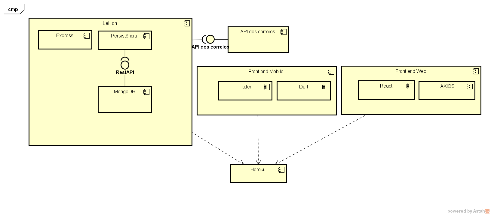

# Leil-on

**Guilherme Augusto Gomes Cunha, guilhermegomescunha@hotmail.com**

**Leonardo Antunes Barreto Noman, leonoman07@gmail.com**

**Pedro Henrique Magalhães Silva, magengsoft@gmail.com**

---

Professores:

**Hugo Bastos de Paula**

**Pedro Alves de Oliveira**

---

_Curso de Engenharia de Software, Unidade Praça da Liberdade_

_Instituto de Informática e Ciências Exatas – Pontifícia Universidade de Minas Gerais (PUC MINAS), Belo Horizonte – MG – Brasil_

---

_**Resumo**. Escrever aqui o resumo. O resumo deve contextualizar rapidamente o trabalho, descrever seu objetivo e, ao final, 
mostrar algum resultado relevante do trabalho (até 10 linhas)._

---

## Histórico de Revisões

| **Data** | **Autor** | **Descrição** | **Versão** |
| --- | --- | --- | --- |
| **[24/02/2021]** | [Pedro, Guilherme, Leonardo] | [Elaboração da seção 1 do documento de arquitetura] | [1.0] |
| | | | |
| | | | |

## SUMÁRIO

1. [Apresentação](#apresentacao "Apresentação")  
	1.1. Problema  
	1.2. Objetivos do trabalho  
	1.3. Definições e Abreviaturas  

2. [Requisitos](#requisitos "Requisitos")  
'	2.1. Requisitos Funcionais  
	2.2. Requisitos Não-Funcionais  
	2.3. Restrições Arquiteturais  
	2.4. Mecanismos Arquiteturais  

3. [Modelagem](#modelagem "Modelagem e projeto arquitetural")  
	3.1. Visão de Negócio  
	3.2. Visão Lógica  
	3.3. Modelo de dados (opcional)  

4. [Avaliação](#avaliacao "Avaliação da Arquitetura")  
	4.1. Cenários  
	4.2. Avaliação  

5. [Referências](#referencias "REFERÊNCIAS") 

6. [Apêndices](#apendices "APÊNDICES") 

# 1. Apresentação

Leilão é uma modalidade de negociação, onde o comprador vencedor obtém o produto. A sua dinâmica se baseia na oferta e demanda, o que influencia diretamente no preço final. Essa modalidade de negociação precisa muitas vezes de mobilidade, pesquisas rápidas e fáceis para encontrar os produtos do interessado em sua aquisição.
   Leilões são um meio simples e fácil de se vender alguns itens usados e comprar produtos com preços abaixo do mercado. Uma das referências utilizadas no projeto são os leilões do site chamado LigaMagic, um site que organiza várias lojas do jogo Magic: the gathering. Nesses leilões é muito comum encontrar preços bem abaixo do mercado, fazendo assim o vendedor ter algum retorno do item que não deseja e o comprador tendo acesso a esse item por um preço melhor.

## 1.1. Problema

A dificuldade do potencial comprador em achar os produtos que lhe interessam por um bom preço. Leilões presenciais exigem mobilidade por parte do comprador. Dificuldade por parte do vendedor de se achar interessado no(s) item(s) que deseja vender.

## 1.2. Objetivos do trabalho

O  Leil-on tem como objetivo desenvolver um aplicativo que facilite a pesquisa por produtos, facilitar negociações e fornecer um meio para compra e venda de itens.

<ul>1.2.1 Objetivos Específicos
	<li>Facilitar a busca de produtos rentáveis para potenciais compradores;</li>
	<li>Possibilitar que vendedores recebam uma melhor oferta pelos produtos;</li>
<li>Tornar acessível para os usuários, negociações de itens sem a necessidade de estarem presentes fisicamente;</li> 
 </ul>

## 1.3. Definições e Abreviaturas

Coloque aqui as definições, siglas e abreviaturas utilizadas no trabalho._

# 2. Requisitos

## 2.1. Requisitos Funcionais

| **ID** | **Descrição** | **Prioridade** |
| --- | --- | --- |
| RF001 | Criação do leilão por parte do vendedor | Essencial |
| RF002 | Listagem dos leilões | Essencial |
| RF003 | Encontrar leilões | Essencial |
| RF004 | Propor oferta para o item | Essencial |
| RF005 | Login e cadastro de usuários | Essencial |
| RF006 | Sistema notifica o comprador quando ele ganhar um leilão | Essencial |
| RF007 | Sistema de reputação para compradores e vendedores  | Desejável |
| RF008 | Fornecer o valor do frete | Desejável |
| RF009 | Fórum do leilão | Desejável |

## 2.2. Requisitos Não-Funcionais

| **ID** | **Descrição** |
| --- | --- |
| RNF001 | O sistema deve suportar 500 usuários simultâneos |
| RNF002 | O sistema deve responder em até 100 milissegundos |
| RNF003 | O sistema deve ser hibrido |

## 2.3. Restrições Arquiteturais

<ul>As restrições impostas ao projeto que afetam sua arquitetura são:
	<li>O software deverá ser desenvolvido em Javascript/Node.js;</li>
	<li>A comunicação da API deve seguir o padrão RESTful;</li>
	<li>O frontend usará a tecnologia Flutter.</li>
</ul>

## 2.4. Mecanismos Arquiteturais

| **Análise** | **Design** | **Implementação** |
| --- | --- | --- |
| Persistência | Banco de dados relacional| MongoDB |
| Front end | Kit de desenvolvimento | Flutter |
| Back end | Ambiente de execução | NodeJS |
| Log do sistema | Middleware | Morgan |
| Teste de Software | Framework | Mocha |
| Deploy | PaaS | Heroku |

# 3. Modelagem e projeto arquitetural

_Apresente uma visão geral da solução proposta para o projeto e explique brevemente esse diagrama de visão geral, de forma textual. Esse diagrama não precisa seguir os padrões da UML, e deve ser completo e tão simples quanto possível, apresentando a macroarquitetura da solução._

.png)

**Figura 1 - Visão Geral da Solução (fonte: https://medium.com)**

## 3.1. Visão de Negócio (Funcionalidades)

<ol>	
<li>O sistema deve cadastrar usuários e permitir que esses usuários acessem o sistema.</li>
<li>O sistema deve permitir criação de um leilão por parte de um vendedor.</li>
<li>O sistema deve permitir a visualização dos leilões disponíveis</li>
<li>O sistema deve permitir ao usuário dar um lance num item de um leilão.</li>
</ol>

### Descrição resumida dos Casos de Uso / Histórias de Usuário

_Nesta seção, os casos de uso devem ser resumidos. Esse detalhamento pode ser na forma de um texto sintético ou, alternativamente, você pode optar por descrever estórias de usuários seguindo os métodos ágeis. Neste caso a seção deve chamar &quot;Histórias de usuários&quot;. Lembre-se das características de qualidade das estórias de usuários, ou seja, o que é preciso para descrever boas histórias de usuários._

Exemplos de resumo de Casos de Uso:

#### UC01 – NOME DO CASO DE USO 01

| **Descrição** | |
| --- | --- |
| **Atores** | |
| **Prioridade** | |
| **Requisitos associados** | |
| **Fluxo Principal** | |

#### UC02 – NOME DO CASO DE USO 02

| **Descrição** | |
| --- | --- |
| **Atores** | |
| **Prioridade** | |
| **Requisitos associados** | |
| **Fluxo Principal** | |

<ul>Exemplos de Histórias de Usuário:

<li>Como Comprador eu quero poder ver vários leilões para ter acesso a diversos itens, com o melhor preço.</li>

<li>Como Vendedor eu quero poder criar um leilão, para que possa vender um ou mais itens.</li>

<li>Como Comprador eu quero receber uma notificação quando um lance meu foi batido.</li>
</ul>

## 3.2. Visão Lógica

_Apresente os artefatos que serão utilizados descrevendo em linhas gerais as motivações que levaram a equipe a utilizar estes diagramas._

### Diagrama de Classes

**Figura 2 – Diagrama de classes (exemplo). Fonte: o próprio autor.**

Obs: Acrescente uma breve descrição sobre o diagrama apresentado na Figura 3.

### Diagrama de componentes

_Apresente o diagrama de componentes da aplicação, indicando, os elementos da arquitetura e as interfaces entre eles. Liste os estilos/padrões arquiteturais utilizados e faça uma descrição sucinta dos componentes indicando o papel de cada um deles dentro da arquitetura/estilo/padrão arquitetural. Indique também quais componentes serão reutilizados (navegadores, SGBDs, middlewares, etc), quais componentes serão adquiridos por serem proprietários e quais componentes precisam ser desenvolvidos._

**Figura 3 – Diagrama de Componentes (exemplo). Fonte: o próprio autor.**

_Apresente uma descrição detalhada dos artefatos que constituem o diagrama de implantação._

Ex: conforme diagrama apresentado na Figura X, as entidades participantes da solução são:

- **Componente 1** - Lorem ipsum dolor sit amet, consectetur adipiscing elit. Cras nunc magna, accumsan eget porta a, tincidunt sed mauris. Suspendisse orci nulla, sagittis a lorem laoreet, tincidunt imperdiet ipsum. Morbi malesuada pretium suscipit.
- **Componente 2** - Praesent nec nisi hendrerit, ullamcorper tortor non, rutrum sem. In non lectus tortor. Nulla vel tincidunt eros.

## 3.3. Modelo de dados (opcional)

_Caso julgue necessário para explicar a arquitetura, apresente o diagrama de classes ou diagrama de Entidade/Relacionamentos ou tabelas do banco de dados. Este modelo pode ser essencial caso a arquitetura utilize uma solução de banco de dados distribuídos ou um banco NoSQL._

 ")

**Figura 4 – Diagrama de Entidade Relacionamento (ER) - exemplo. Fonte: o próprio autor.**

Obs: Acrescente uma breve descrição sobre o diagrama apresentado na Figura 3.

# 4. Avaliação da Arquitetura

_Esta seção descreve a avaliação da arquitetura apresentada, baseada no método ATAM._

## 4.1. Cenários

_Apresente os cenários de testes utilizados na realização dos testes da sua aplicação. Escolha cenários de testes que demonstrem os requisitos não funcionais sendo satisfeitos. Os requisitos a seguir são apenas exemplos de possíveis requisitos, devendo ser revistos, adequados a cada projeto e complementados de forma a terem uma especificação completa e auto-explicativa._

**Cenário 1 - Acessibilidade:** Suspendisse consequat consectetur velit. Sed sem risus, dictum dictum facilisis vitae, commodo quis leo. Vivamus nulla sem, cursus a mollis quis, interdum at nulla. Nullam dictum congue mauris. Praesent nec nisi hendrerit, ullamcorper tortor non, rutrum sem. In non lectus tortor. Nulla vel tincidunt eros.

**Cenário 2 - Interoperabilidade:** Pellentesque habitant morbi tristique senectus et netus et malesuada fames ac turpis egestas. Fusce ut accumsan erat. Pellentesque in enim tempus, iaculis sem in, semper arcu.

**Cenário 3 - Manutenibilidade:** Phasellus magna tellus, consectetur quis scelerisque eget, ultricies eu ligula. Sed rhoncus fermentum nisi, a ullamcorper leo fringilla id. Nulla lacinia sem vel magna ornare, non tincidunt ipsum rhoncus. Nam euismod semper ante id tristique. Mauris vel elit augue.

**Cenário 4 - Segurança:** Suspendisse consectetur porta tortor non convallis. Sed lobortis erat sed dignissim dignissim. Nunc eleifend elit et aliquet imperdiet. Ut eu quam at lacus tincidunt fringilla eget maximus metus. Praesent finibus, sapien eget molestie porta, neque turpis congue risus, vel porttitor sapien tortor ac nulla. Aliquam erat volutpat.

## 4.2. Avaliação

_Apresente as medidas registradas na coleta de dados. O que não for possível quantificar apresente uma justificativa baseada em evidências qualitativas que suportam o atendimento do requisito não-funcional. Apresente uma avaliação geral da arquitetura indicando os pontos fortes e as limitações da arquitetura proposta._

| **Atributo de Qualidade:** | Segurança |
| --- | --- |
| **Requisito de Qualidade** | Acesso aos recursos restritos deve ser controlado |
| **Preocupação:** | Os acessos de usuários devem ser controlados de forma que cada um tenha acesso apenas aos recursos condizentes as suas credenciais. |
| **Cenários(s):** | Cenário 4 |
| **Ambiente:** | Sistema em operação normal |
| **Estímulo:** | Acesso do administrador do sistema as funcionalidades de cadastro de novos produtos e exclusão de produtos. |
| **Mecanismo:** | O servidor de aplicação (Rails) gera um _token_ de acesso para o usuário que se autentica no sistema. Este _token_ é transferido para a camada de visualização (Angular) após a autenticação e o tratamento visual das funcionalidades podem ser tratados neste nível. |
| **Medida de Resposta:** | As áreas restritas do sistema devem ser disponibilizadas apenas quando há o acesso de usuários credenciados. |

**Considerações sobre a arquitetura:**

| **Riscos:** | Não existe |
| --- | --- |
| **Pontos de Sensibilidade:** | Não existe |
| _ **Tradeoff** _ **:** | Não existe |

Evidências dos testes realizados

_Apresente imagens, descreva os testes de tal forma que se comprove a realização da avaliação._

# 5. REFERÊNCIAS

_Como um projeto da arquitetura de uma aplicação não requer revisão bibliográfica, a inclusão das referências não é obrigatória. No entanto, caso você deseje incluir referências relacionadas às tecnologias, padrões, ou metodologias que serão usadas no seu trabalho, relacione-as de acordo com a ABNT._

Verifique no link abaixo como devem ser as referências no padrão ABNT:

http://www.pucminas.br/imagedb/documento/DOC\_DSC\_NOME\_ARQUI20160217102425.pdf

**[1]** - _ELMASRI, Ramez; NAVATHE, Sham. **Sistemas de banco de dados**. 7. ed. São Paulo: Pearson, c2019. E-book. ISBN 9788543025001._

**[2]** - _COPPIN, Ben. **Inteligência artificial**. Rio de Janeiro, RJ: LTC, c2010. E-book. ISBN 978-85-216-2936-8._

**[3]** - _CORMEN, Thomas H. et al. **Algoritmos: teoria e prática**. Rio de Janeiro, RJ: Elsevier, Campus, c2012. xvi, 926 p. ISBN 9788535236996._

**[4]** - _SUTHERLAND, Jeffrey Victor. **Scrum: a arte de fazer o dobro do trabalho na metade do tempo**. 2. ed. rev. São Paulo, SP: Leya, 2016. 236, [4] p. ISBN 9788544104514._

**[5]** - _RUSSELL, Stuart J.; NORVIG, Peter. **Inteligência artificial**. Rio de Janeiro: Elsevier, c2013. xxi, 988 p. ISBN 9788535237016._

# 6. APÊNDICES

_Inclua o URL do repositório (Github, Bitbucket, etc) onde você armazenou o código da sua prova de conceito/protótipo arquitetural da aplicação como anexos. A inclusão da URL desse repositório de código servirá como base para garantir a autenticidade dos trabalhos._
Referências
LEILÕES Liga Magic. In: Liga Magic Leilões. [S. l.]. Disponível em: https://www.ligamagic.com.br/?view=leilao/listar. Acesso em: 18 fev. 2021.

