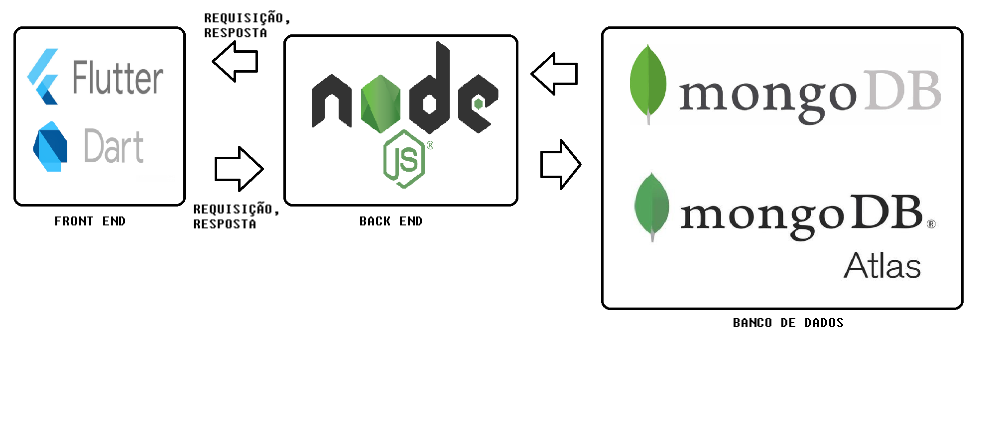
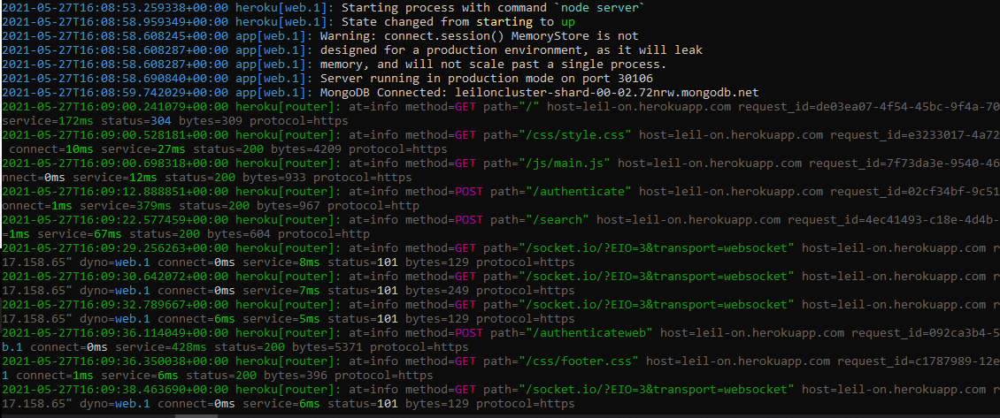
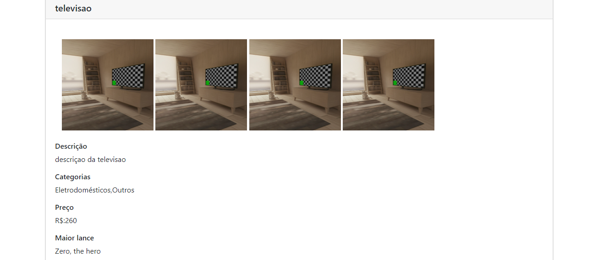

# Leil-on

**Guilherme Augusto Gomes Cunha, guilhermegomescunha@hotmail.com**

**Pedro Henrique Magalhães Silva, magengsoft@gmail.com**

---

Professores:

**Hugo Bastos de Paula**

**Pedro Alves de Oliveira**

---

_Curso de Engenharia de Software, Unidade Praça da Liberdade_

_Instituto de Informática e Ciências Exatas – Pontifícia Universidade de Minas Gerais (PUC MINAS), Belo Horizonte – MG – Brasil_

---

_**Resumo**. Leilões são uma forma comum de compra e venda de itens, pessoas que não precisam mais de determinados itens e pessoas que querem ter acesso a esses itens por um preço abaixo do mercado vão atrás de leilões. O objetivo no projeto é desenvolver uma plataforma onde pessoas possam criar e participar de leilões de qualquer lugar que ela tenho acesso a internet. O sistema será hibrido, portanto pessoas apenas com telefones ou algum outro aparelho móvel podem ter acesso a plataforma._

---

## Histórico de Revisões

| **Data** | **Autor** | **Descrição** | **Versão** |
| --- | --- | --- | --- |
| **[24/02/2021]** | [Guilherme, Leonardo e Pedro] | [Elaboração da seção 1 do documento de arquitetura] | [1.0] |
| **02/03/2021** | [Guilherme, Leonardo e Pedro] |  [Elaboração da sessão 2, elaboração de parte da sessão 3 e correção da seção 1] | [1.1] |
| **11/03/2021** | [Guilherme] | [Pequenas correções em alguns itens e conversão para markdown]| [1.1.1] |
| **23/03/2021** | [Pedro] | [Criação e alteração das funcionalidades e história de usuário]| [1.1.2] |
| **15/04/2021** | [Guilherme] | [Correção dos diagramas e listagem dos componentes. ]| [1.8] |
| **12/05/2021** | [Guilherme] | [Correção nas tecnologias e funcionalidades. ]| [2.0] |
| **27/05/2021** | [Guilherme] | [Correção em alguns campos, atualização de diagramas e última parte feita. ]| [3.0] |

## SUMÁRIO

1. [Apresentação](#apresentacao "Apresentação")  
	1.1. Problema  
	1.2. Objetivos do trabalho  
	1.3. Definições e Abreviaturas  

2. [Requisitos](#requisitos "Requisitos")  
'	2.1. Requisitos Funcionais  
	2.2. Requisitos Não-Funcionais  
	2.3. Restrições Arquiteturais  
	2.4. Mecanismos Arquiteturais  

3. [Modelagem](#modelagem "Modelagem e projeto arquitetural")  
	3.1. Visão de Negócio  
	3.2. Visão Lógica  
	3.3. Modelo de dados (opcional)  

4. [Avaliação](#avaliacao "Avaliação da Arquitetura")  
	4.1. Cenários  
	4.2. Avaliação  

5. [Referências](#referencias "REFERÊNCIAS") 

6. [Apêndices](#apendices "APÊNDICES") 

# 1. Apresentação

Leilão é uma modalidade de negociação, onde o comprador vencedor obtém o produto. A sua dinâmica se baseia na oferta e demanda, o que influencia diretamente no preço final. Essa modalidade de negociação precisa muitas vezes de mobilidade, pesquisas rápidas e fáceis para encontrar os produtos do interessado em sua aquisição.
   Leilões são um meio simples e fácil de se vender alguns itens usados e comprar produtos com preços abaixo do mercado. Uma das referências utilizadas no projeto são os leilões do site chamado LigaMagic, um site que organiza várias lojas do jogo Magic: the gathering. Nesses leilões é muito comum encontrar preços bem abaixo do mercado, fazendo assim o vendedor ter algum retorno do item que não deseja e o comprador tendo acesso a esse item por um preço melhor.

## 1.1. Problema

A dificuldade do potencial comprador em achar os produtos que lhe interessam por um bom preço. Leilões presenciais exigem mobilidade por parte do comprador. Dificuldade por parte do vendedor de se achar interessado no(s) item(s) que deseja vender.

## 1.2. Objetivos do trabalho

O  Leil-on tem como objetivo desenvolver um aplicativo que facilite a pesquisa por produtos, facilitar negociações e fornecer um meio para compra e venda de itens.

<ul>1.2.1 Objetivos Específicos
	<li>Facilitar a busca de produtos rentáveis para potenciais compradores;</li>
	<li>Possibilitar que vendedores recebam uma melhor oferta pelos produtos;</li>
<li>Tornar acessível para os usuários, negociações de itens sem a necessidade de estarem presentes fisicamente;</li> 
 </ul>

## 1.3. Definições e Abreviaturas

Flutter é um software de interface de usuário de código aberto.   
Dart é uma linguagem de programação de aplicativos para multiplataforma.   
Node.js é um ambiente de tempo de execução JavaScript de back-end.   
JavaScript é uma linguagem de programação de alto nível.   
MongoDB é um banco de dados não relacional.   
MongoDB Atlas é uma ferramente de cloud para o MongoDB.

# 2. Requisitos

## 2.1. Requisitos Funcionais

| **ID** | **Descrição** | **Prioridade** |
| --- | --- | --- |
| RF001 | Criação do leilão por parte do vendedor | Essencial |
| RF002 | Listagem dos leilões | Essencial |
| RF003 | Encontrar leilões | Essencial |
| RF004 | Propor oferta para o item | Essencial |
| RF005 | Login e cadastro de usuários | Essencial |
| RF006 | Sistema notifica o comprador quando ele ganhar um leilão | Essencial |
| RF007 | Chat para que os usuários possam conversar sobre os leilões e itens | Essencial |
| RF008 | Sistema de reputação para compradores e vendedores  | Desejável |
| RF009 | Fornecer o valor do frete | Desejável |
| RF010 | Fórum do leilão | Desejável |

## 2.2. Requisitos Não-Funcionais

| **ID** | **Descrição** |
| --- | --- |
| RNF001 | O sistema deve suportar 500 usuários simultâneos |
| RNF002 | O sistema deve responder em até 500 milissegundos |
| RNF003 | O sistema deve ser hibrido |

## 2.3. Restrições Arquiteturais

<ul>As restrições impostas ao projeto que afetam sua arquitetura são:
	<li>O software deverá ser desenvolvido em Javascript/Node.js;</li>
	<li>A comunicação da API deve seguir o padrão RESTful;</li>
	<li>O frontend usará a tecnologia Flutter.</li>
</ul>

## 2.4. Mecanismos Arquiteturais

| **Análise** | **Design** | **Implementação** |
| --- | --- | --- |
| Persistência | Banco de dados relacional| MongoDB |
| Front end | Kit de desenvolvimento | Flutter |
| Front end | Processador de templates | Handlebars |
| Back end | Ambiente de execução | NodeJS |
| Integração| Entrega continuas | Heroku + GitHub |
| Log do sistema | Middleware | Morgan |
| Teste de Software | Framework | Mocha |
| Deploy | PaaS | Heroku |

# 3. Modelagem e projeto arquitetural

_Apresente uma visão geral da solução proposta para o projeto e explique brevemente esse diagrama de visão geral, de forma textual. Esse diagrama não precisa seguir os padrões da UML, e deve ser completo e tão simples quanto possível, apresentando a macroarquitetura da solução._

**Figura 1 - Visão Geral da Solução**

## 3.1. Visão de Negócio (Funcionalidades)

<ol>	
<li> O sistema deve cadastrar usuários e permitir que esses usuários acessem o sistema.OK</li>
<li> O sistema deve permitir criação de um leilão por parte do vendedor.OK</li>
<li> O sistema deve permitir que o vendedor tenha privilégios de administrador do leilão que ele criou.</li>
<li> O sistema deve notificar ao vencedor e ao dono do item quando o leilão terminar.</li>
<li> O sistema deve permitir um mecanismo de pesquisa por itens em que o usuário esteja interessado.</li>
<li> O sistema deve permitir a visualização dos leilões disponíveis que possuem os itens do interesse do comprador.</li>
<li> O sistema deve permitir que o usuário veja as informações do leilão, dos itens de seu interesse e do vendedor.OK</li>
<li> O sistema deve permitir que o usuário tire as suas dúvidas a respeito do produto através de um fórum.</li>
<li> O sistema deve permitir ao usuário dar um lance num item de um leilão.OK</li>
<li> O sistema deve permitir que o usuário acompanhe o leilão em que esteja participando como comprador.OK</li>
<li> O sistema deve permitir que o usuário acompanhe o leilão em que esteja participando como vendedor</li>
<li> O sistema deve notificar o usuário que deu o maior lance do item quando seu lance for batido.OK</li>
</ol>

### Histórias de Usuário

<li>Como usuário, eu quero comprar e vender produtos, para que eu possa escolher a forma como vou participar de um leilão.</li>
<li>Como usuário, eu quero editar o meu perfil, para que eu possa atualizar dados pessoais.</li>
<li>Como usuário, eu quero acompanhar os leilões em que participo e/ou os leilões que criei, para que eu possa visualizar as ofertas.</li>
<li>Como vendedor, eu quero ver a reputação dos compradores interessados, para que eu possa tomar melhores decisões.</li>
<li>Como vendedor, eu quero poder gerenciar o leilão que criei, para que eu possa aceitar a oferta, excluir participante ou encerrar o leilão.</li>
<li>Como vendedor, eu quero estipular o preço mínimo do produto, para que o preço final esteja mais próximo do meu interesse.</li>
<li>Como Vendedor, eu quero poder criar um leilão, para que possa vender um ou mais itens.</li>
<li>Como Comprador, eu quero poder procurar os itens do meu interesse , para que eu possa participar de leilões que anuncie esses itens.</li>
<li>Como Comprador, eu quero receber uma notificação quando um lance meu foi batido, para que eu possa negociar com o vendedor os termos de pagamento e entrega.</li>
<li>Como comprador, eu quero visualizar informações do leilão, para que eu possa esta ciente do leilão.</li>
<li>Como comprador, eu quero saber a localização do produto, para melhor estimar o custo do item.</li>
<li>Como comprador, eu quero ver a reputação do vendedor, para que eu possa avaliar se é seguro participar do leilão.</li>
<li>Como comprador, eu quero um fórum, pra que eu tire dúvidas a respeito dos produtos do meu interesse</li>
<li>Como comprador, eu quero ver o prazo do encerramento do leilão, para que eu não perca a oportunidade de comprar o item do meu interesse.</li>
<li>Como comprador, eu quero realizar ofertas do produto do meu interesse, para que eu possa ter o produto</li>
</ul>

## 3.2. Visão Lógica

### Diagrama de componentes

_Apresente o diagrama de componentes da aplicação, indicando, os elementos da arquitetura e as interfaces entre eles. Liste os estilos/padrões arquiteturais utilizados e faça uma descrição sucinta dos componentes indicando o papel de cada um deles dentro da arquitetura/estilo/padrão arquitetural. Indique também quais componentes serão reutilizados (navegadores, SGBDs, middlewares, etc), quais componentes serão adquiridos por serem proprietários e quais componentes precisam ser desenvolvidos._

**Figura 3 – Diagrama de Componentes (exemplo). Fonte: o próprio autor.**

_Apresente uma descrição detalhada dos artefatos que constituem o diagrama de implantação._

Ex: conforme diagrama apresentado na Figura X, as entidades participantes da solução são:

- **Componente 1** -Leil-on Sistema de leilão de online. Engloba o sistema inteiro com seus componentes.
- **Componente 2** - Express é um framework para aplicações web para Node.js, é usado no projeto para ter acesso a suas várias tecnologias e serviços como: Morgan, passport e cors.
- **Componente 3** - Heroku é usado para o "deploy" do sistema.
- **Componente 4** - MongoDB é um banco de dados não relacional, é usado para armazenar e persistir os dados.
- **Componente 5** - MongoDBAtlas é o cluster do MongoDB para armazenar os dados na nuvem.
- **Componente 6** - Flutter é um kit de desenvolvimento de interface de usuário, usado para criar e gerenciar a interface do usuário na parte mobile.
- **Componente 7** - O React é uma biblioteca utilizada no projeto para criar e gerenciar a interface do usuário na parte Web.

## 3.3. Modelo de dados 

 ")

**Figura 4 – Diagrama de Entidade Relacionamento (ER) - exemplo. Fonte: o próprio autor.**

# 4. Avaliação da Arquitetura

## 4.1. Cenários

**Cenário 1 - Eficiência -  RNF002 :** O sistema responde a maioria das rotas que deram certo num tempo de execução menor do que 500 ms, o que foi previsto inicialmente seria 100 e depois alterado para 500. 

**Cenário 2 - Sistema Hibrido -  RNF003 :** O sistema funciona na parte mobile e na parte Web, são interligados.

## 4.2. Avaliação

| **Atributo de Qualidade:** | Eficiência |
| --- | --- |
| **Requisito de Qualidade** | O sistema deve ter uma resposta rápida. |
| **Preocupação:** | Em algumas rotas o sistema não está otimizado ou o sistema tem que fazer muita coisa. |
| **Cenários(s):** | Cenário 1 |
| **Ambiente:** | Sistema em operação normal |
| **Estímulo:** | Acesso do front as funcionalidades do back. |
| **Mecanismo:** | O front faz a requisição a parte do back esperando uma resposta. |
| **Medida de Resposta:** | Otimizar o código, dividir funções entre as rotas. |

**Considerações sobre a arquitetura:**

| **Riscos:** | Não existe |
| --- | --- |
| **Pontos de Sensibilidade:** | Não existe |
| _ **Tradeoff** _ **:** | Mais eficiência implica numa maior complexidade. |

Evidências dos testes realizados

Tempo de resposta do sistema.

Item em leilão na parte mobile

Item em leilão na parte web

# 5. REFERÊNCIAS

**[1]** - _LEILÕES Liga Magic. In: Liga Magic Leilões. [S. l.]. Disponível em: https://www.ligamagic.com.br/?view=leilao/listar. Acesso em: 18 fev. 2021._

# 6. APÊNDICES

https://github.com/ICEI-PUC-Minas-PPLES-TI/Leil-on

